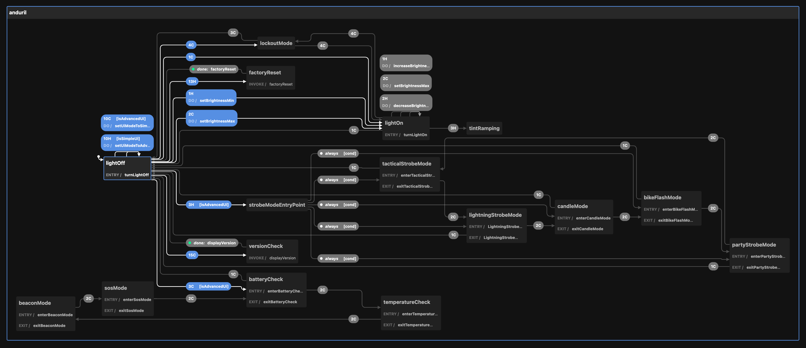

# 🔦 Andúril 2 Firmware

## Current Progress

Using the [XState Visualizer](https://stately.ai/viz):



## Setup

```
npm run dev
```

## Resources

- [Reddit: Andúril 2 UI Chart](https://www.reddit.com/r/flashlight/comments/sk1upj/and%C3%BAril_2_ui_chart/)
- [Reddit: Andúril 2 UI Chart Image](https://www.reddit.com/media?url=https%3A%2F%2Fpreview.redd.it%2F7wyo5bho9epa1.png%3Fwidth%3D5869%26format%3Dpng%26auto%3Dwebp%26s%3D38f418ba6edadffea4148479288818137f6efcdd)
- [Diagram](https://ivanthinking.net/images/anduril2/ui-diagram.png)
- [Manual](https://ivanthinking.net/thoughts/anduril2-manual)
